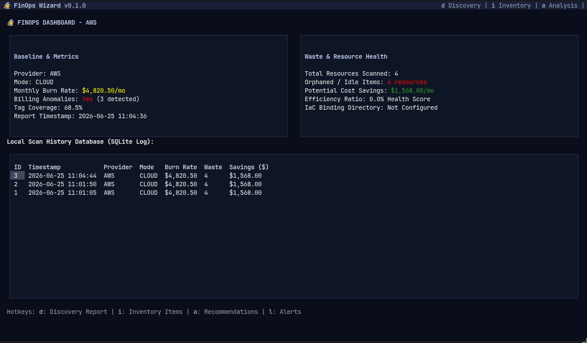
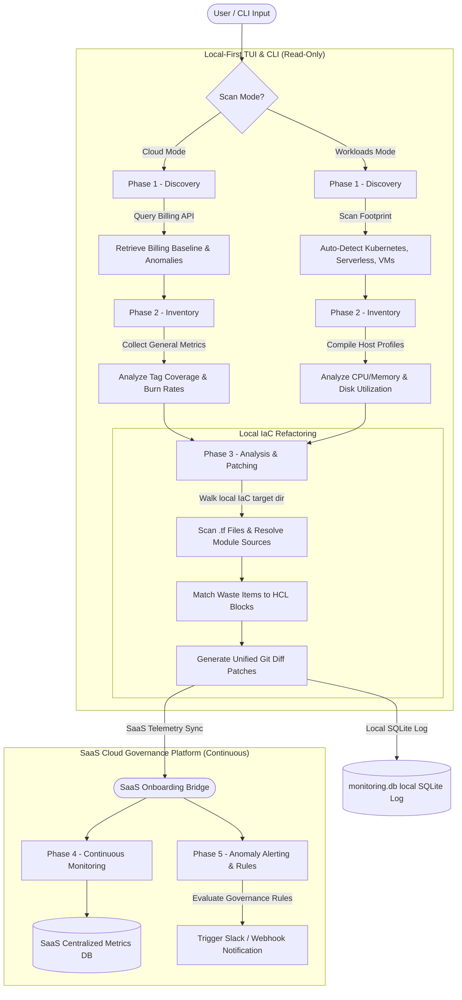

# FinOps Wizard



FinOps Wizard is a local-first, trust-building cloud cost optimization and governance platform. It features an interactive terminal user interface (TUI) and a headless CLI to discover workloads, scan resource utilization waste, generate Terraform refactoring patches, persist results locally, and alert on governance violations.

## Application Workflow



---

## Model Context Protocol (MCP) Integration

For real-time feedback during Infrastructure as Code (IaC) development, see the [FinOps Wizard MCP Server](README_MCP.md) documentation.

This MCP server connects developer IDEs directly to the SaaS Cloud Governance Platform, allowing AI coding assistants to evaluate proposed resource sizing (e.g., VM families, Kubernetes node specs, serverless memory allocation) against historical baselines and corporate policies in real-time, before any code is committed.

---

## Key Features & Capabilities

### 1. Interactive Terminal User Interface (TUI)
Adapted from the elegant Dolphie dashboard layout using Textual:
* **Configuration Menu:** Input targets (like local IaC directories and LLM keys) and select cloud providers or scan modes via modal dialog popups.
* **API Dry-Run Console:** Proves read-only safety by logging every CLI or SDK query command visually in real-time during scan phases.
* **Central Dashboard:** Presents monthly burn rates, efficiency health scores, and retrieves execution runs directly from the local SQLite log.
* **Interactive Views:** Dedicated sub-screens show discovery telemetry datasets, scrollable waste resource catalogs, markdown recommendations, and active governance alerts.

### 2. Headless CLI Mode
Fully scriptable with Typer for automation or integration in CI/CD pipelines:
* Execute individual phases or complete optimization flows.
* Pass arguments to filter target workloads, choose cloud providers, point to local IaC directories, or configure Slack/HTTP alerts.

### 3. The 5-Phase FinOps Lifecycle
* **Phase 1: Discovery:** Baseline billing anomalies, anomalous spend monitors, and auto-detects workload types (Kubernetes cluster nodes, VMs, serverless footprints).
* **Phase 2: Inventory:** Compiles utilization profiles (CPU cores, memory requests, disk IOPS) to classify idle or orphaned resources.
* **Phase 3: Cost Analysis & Patching:** Broad-block HCL parser recursively walks local module references (resolving `./` or `../` sources), detects overprovisioned values (variables, comments, or literals), and outputs clean, unified git diff patches.
* **Phase 4: Monitoring persistence:** Automatically records baseline histories locally to `monitoring.db` via SQLite.
* **Phase 5: Governance Alerting:** Validates governance rules (Burn Rate > $2000, Tag Coverage < 70%, Waste > $200) and executes webhook notification triggers.

---

## Repository Structure

* **`finops_wizard/`**: Python application package.
  * **`core/`**: Life-cycle phase engines (Discovery, Inventory, Analysis, SQLite Monitoring, Alerting).
  * **`adapters/`**: AWS, GCP, and Azure mock cloud command loggers.
  * **`tui/`**: Textual TUI screens, styles (`styles.tcss`), and Selection/Command modals.
* **`examples/iac/`**: Enterprise-style modular Terraform codebase structure used as a local reference target.
* **`tests/`**: Automated Pytest unit and integration test suite.

---

## Installation & Setup

Ensure you have `uv` installed. Run the following from the project root:

```bash
# Install dependencies in editable mode
uv pip install -e .

# Run the interactive TUI application
uv run finops-wizard

# Run automated tests
uv run pytest
```

---

## Headless CLI Usage Examples

```bash
# Scan AWS workloads and print inventory JSON
PYTHONPATH=. uv run finops-wizard --mode workloads --provider aws --phase inventory

# Scan GCP baseline cloud costs and evaluate alerting
PYTHONPATH=. uv run finops-wizard --mode cloud --provider gcp --phase alerting

# Run analysis on local enterprise IaC and output Terraform diff patches
PYTHONPATH=. uv run finops-wizard --mode workloads --provider aws --phase analysis --iac-dir examples/iac/environments/production
```
