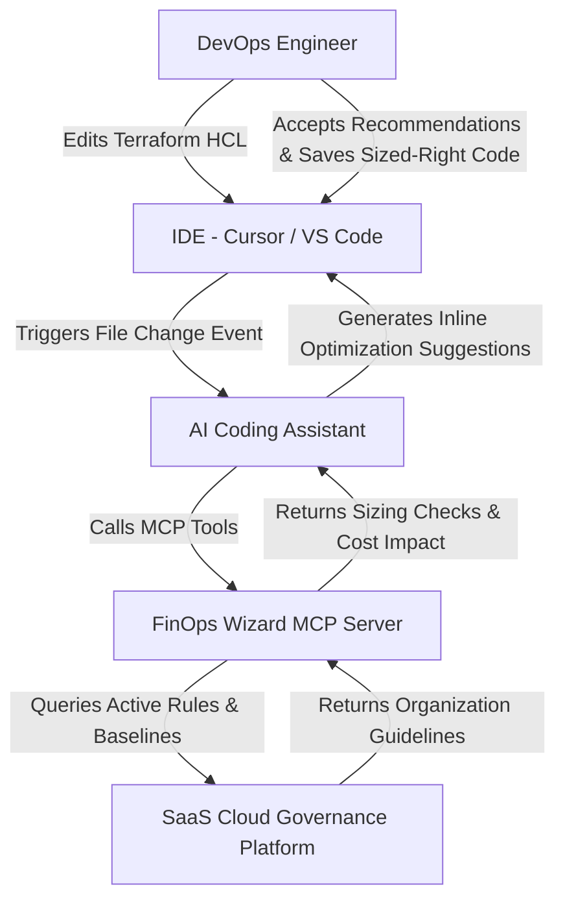

# FinOps Wizard MCP Server

The **FinOps Wizard MCP Server** is a Model Context Protocol (MCP) server designed to shift cost optimization and governance left. It enables AI coding assistants (like Cursor, Claude Code, or VS Code Copilots) to interface directly with the **SaaS Cloud Governance Platform** in real-time. 

As DevOps engineers write or modify Infrastructure as Code (IaC) files, the AI assistant queries the MCP server to review sizing configurations against historical baseline utilization metrics and organizational governance guidelines *before* committing code or applying plans.

---

## Architectural Workflow

Below is the workflow showing how the MCP server coordinates between the developer's IDE, the AI coding agent, and the SaaS governance platform:



---

## Exposed MCP Tools

The server exposes three primary tool endpoints to the AI model context:

### 1. `get_environment_baseline`
* **Purpose:** Retrieves the active monthly cost burn rate, waste ratio, and average resource utilization logs for a target environment.
* **Arguments:**
  * `environment` (string, required): e.g., `"production"`, `"staging"`.
  * `provider` (string, required): e.g., `"aws"`, `"gcp"`, `"azure"`.
* **Output:** JSON payload with active efficiency scores and resource-level cost trends.

### 2. `evaluate_resource_sizing`
* **Purpose:** Evaluates the proposed configuration size (such as VM instance type, storage disk volume class, or serverless memory allocation) against historical waste thresholds.
* **Arguments:**
  * `resource_type` (string, required): e.g., `"virtual_machine"`, `"lambda_function"`, `"ebs_volume"`.
  * `proposed_spec` (string, required): e.g., `"m5.2xlarge"`, `2048`.
* **Output:** Optimization recommendation indicating if the resource is overprovisioned, suggesting the ideal downsized type (e.g. `"t3.medium"`), and calculating the estimated monthly savings.

### 3. `get_governance_guidelines`
* **Purpose:** Retrieves organizational cost rules, naming templates, mandatory tagging policies, and allowed compute families.
* **Arguments:** None.
* **Output:** Active governance schemas (e.g., target tag keys, baseline limits).

---

## Example DevOps Sizing Scenario

1. **DevOps Action:** A DevOps engineer edits `environments/production/main.tf` to spin up a new EKS node group:
   ```terraform
   module "production_kubernetes" {
     source             = "../../modules/kubernetes"
     cluster_name       = "eks-prod-cluster-1"
     node_instance_type = "m5.2xlarge" # Proposed overprovisioned spec
   }
   ```
2. **AI Intervention:** The editor's AI assistant scans the file change and calls `evaluate_resource_sizing`:
   * **Request:** `resource_type="virtual_machine"`, `proposed_spec="m5.2xlarge"`.
   * **Response:** Flagged as overprovisioned. The historical average CPU utilization for this workload type is below 10%. Suggests downsizing to `"t3.medium"`.
3. **Real-time Suggestion:** The AI assistant displays an inline highlight/refactor card:
   > 🧙 **FinOps Wizard Recommendation:** Node group instance type `m5.2xlarge` is overprovisioned based on production cluster baselines (utilization < 10%). Downsizing to `t3.medium` will save **$340.00/month** (40% savings) while meeting performance guidelines.
4. **Outcome:** DevOps accepts the change in the editor before pushing the PR, avoiding cloud waste at the source.

---

## Setup & Configuration

To register the server with your editor, append the config block to your settings file:

### Cursor (`~/.config/Cursor/User/globalStorage/moe.ehm.copilot/mcp.json`)
```json
{
  "mcpServers": {
    "finops-wizard": {
      "command": "node",
      "args": ["/path/to/finops-wizard-mcp/dist/index.js"],
      "env": {
        "FINOPS_SAAS_API_KEY": "your-saas-token"
      },
      "disabled": false
    }
  }
}
```

### Claude Desktop (`~/.config/Claude/claude_desktop_config.json`)
```json
{
  "mcpServers": {
    "finops-wizard": {
      "command": "npx",
      "args": ["-y", "finops-wizard-mcp-server"],
      "env": {
        "FINOPS_SAAS_API_KEY": "your-saas-token"
      }
    }
  }
}
```
