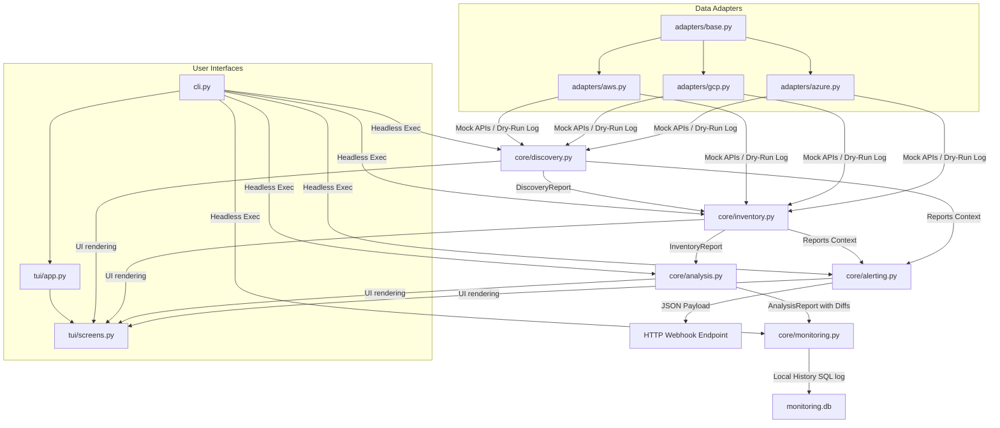

# Domain Context Map: FinOps Wizard Subsystems

This document maps how data flows across the core subsystems of the FinOps Wizard.

## Lifecycle States and Data Contracts

1. **Discovery (Phase 1):** Scans the billing adapter and outputs `DiscoveryReport`.
2. **Inventory (Phase 2):** Queries compute and storage resources using `DiscoveryReport.detected_workloads` and compiles them into `InventoryReport` containing `InventoryItem` listings.
3. **Analysis & Patching (Phase 3):** Inspects the target `iac_dir`, parses Terraform blocks, and matches inventory items to generate `AnalysisReport` with markdown text and unified diff patches.
4. **Monitoring (Phase 4):** Stores `DiscoveryReport` and `InventoryReport` in a local SQLite file using `save_run`.
5. **Alerting (Phase 5):** Evaluates metric thresholds and triggers target HTTP webhooks for active alerts.
