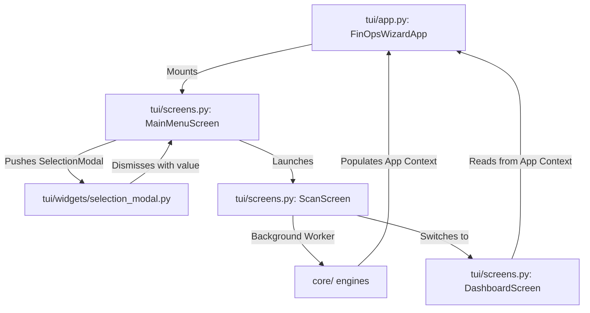

# UI Wiring Specification: Textual TUI

This document details the layout, data flow, and components of the FinOps Wizard TUI application.

---

## User Experience (UX)

The TUI adopts a terminal glassmorphism aesthetic inspired by Dolphie:
* **`MainMenuScreen`:** Landing view for scanning configuration, target directory paths, and engine settings.
* **`ScanScreen`:** Visual feedback on local CLI dry-run logs and execution phases using progress bars and status spinners.
* **`DashboardScreen`:** The central workspace presenting current burn rate, waste analysis score, and a datatable of SQLite local history logs.
* **`DiscoveryScreen` / `InventoryScreen` / `AnalysisScreen` / `AlertingScreen`:** Sub-views to inspect JSON telemetry data, compute inventory catalogs, markdown patches, and governance alert states.

### Keyboard Shortcuts
* **`q`**: Quit the application (available on `MainMenuScreen`).
* **`escape`**: Return to the parent dashboard from sub-screens.
* **`d`**: View Phase 1 Discovery Report.
* **`i`**: View Phase 2 Inventory Catalog.
* **`a`**: View Phase 3 Recommendations & patches.
* **`l`**: View Phase 5 Governance Alerts.
* **`m`**: Return to `MainMenuScreen`.

---

## Data Flow & State Ownership

* **`FinOpsWizardApp` (State Owner):** Maintains global states across active screens:
  * `scan_mode`: `"cloud"` or `"workloads"`
  * `provider`: `ProviderType.AWS` / `GCP` / `AZURE`
  * `iac_dir`: path string to local Terraform modules.
  * `llm_provider` / `llm_api_key`: inference parameters.
  * `discovery_report` / `inventory_report` / `analysis_report` / `alerts`: active run metrics.
* **`SelectionModal`:** A modal popup containing an `OptionList` allowing explicit selection of modes and providers, resolving focus and keyboard entry.
* **`CommandModal`:** A modal dialog capturing text input strings (such as file paths and api credentials).

---

## Bridge Dependencies

* **Cloud Adapters (`adapters/`)**: Instantiated and queried in the background thread of `ScanScreen` to retrieve live cost catalogs and workload profiles without blocking the main event loop.
* **Analysis Engine (`core/analysis.py`)**: Queried on directories to parse relative Terraform files and emit diffs.
* **Monitoring Persistence (`core/monitoring.py`)**: Triggered after scans to save metrics locally to SQLite and manage historical runs log.
